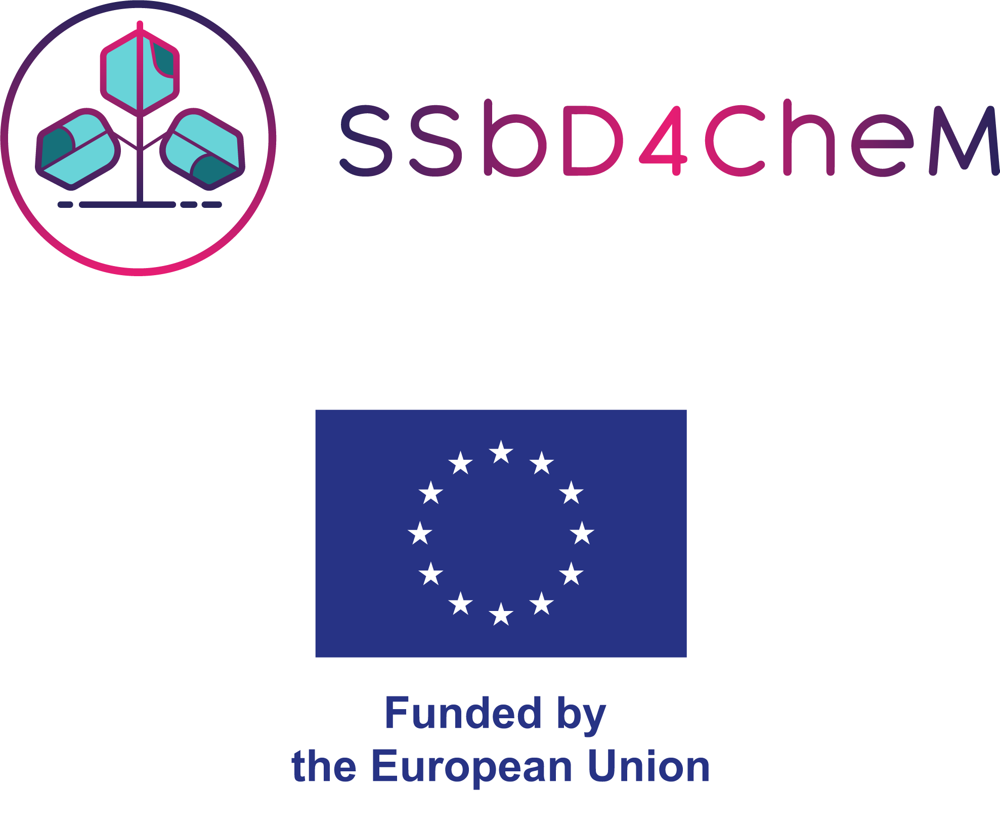

# Formalising product systems which represent dispersed functions with metabolic time-explicit LCA

This repository houses a contribution to [BrightCon 2026](https://indico.d-d-s.ch/event/2/), hosted in Aalborg (Denmark) and online. It will be (or perhaps, is being or has been) presented on 24 September at 10:50 CET as part of the session [T2 - Methods & frontiers](https://indico.d-d-s.ch/event/2/sessions/46/).

## Repository notebooks

The presentation is located in `12_presentation.ipynb`. The main content presented (and much more) can be readily accessed in `11_theory.ipynb`.

While this presentation is aimed at conceptual development, it makes repeated use of a showcase application in support of this conceptual discussion. This case is customised for this purpose, but it is not novel, as is explained in `01_data_attribution.ipynb`. `02_generate_theory_figures.ipynb` records how the case is applied to the present discussion. Note that this case and its manipulation are presented here for purely illustrative purposes.

The `11` and `12` notebooks exclusively make use of figures already present in this repository, in the folders `figures` (for figures which were fully generated as described in the `02` notebook) and `figures_external` (for figures the creation of which involved some external software). These notebooks have no executable code. This is not the case for the `01` and `02` notebooks. Running these notebooks requires an appropriate python environment, like the one described in `environment-t2-2-functional-metabolism.yml` (note that `ipykernel` is not included there, but is required).

## Authors

- Thomas Arblaster\*,1
- Nils Thonemann1
- Joeren Guinée1
- Carlos Felipe Blanco Rocha1,2

\*Presenter and [corresponding](mailto:t.p.s.arblaster@cml.leidenuniv.nl) author.  
1Institute of Environmental Sciences (CML), Leiden University, Leiden, the Netherlands  
2Circularity and Sustainability Impact Group, Netherlands Organisation for Applied Scientific Research (TNO), Utrecht, the Netherlands

## Funding acknowledgement

This work is part of the [SSbD4CheM](https://www.ssbd4chem.eu/) project, which receives funding from the European Union’s Horizon Europe research and innovation programme under grant agreement n° 101138475. UK participants in the SSbD4CheM project are supported by UKRI under grant agreement n° 10110559. CH participants in SSbD4CheM project receive funding from the Swiss State Secretariat for Education, Research and Innovation (SERI). Views and opinions expressed are however those of the author(s) only and do not necessarily reflect those of the European Union. Neither the European Union nor the granting authority can be held responsible for them.

