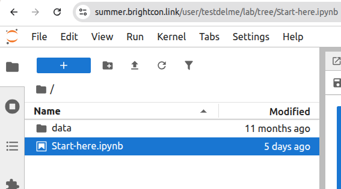

# System Dynamics course

You can find the material:

+ in the jupyterhub "data" server -> database

+ The slides are [here in the repository](./Slides/Training_for_openLCA_system dynamics_vBrightcon.pdf)

> [!NOTE]
> **Optional fallback:** If nothing works, or the internet is broken (but you're still here reading this)
> [Here is the database and the slides](https://share.greendelta.com/index.php/s/nFbDDYDtOdGAUPR)

